# SatyaShield Browser Extension
### *Your Digital Guardian Against Misinformation*

<div align="center">

[](<!-- INSERT_ZIP_DOWNLOAD_LINK -->) [](#-installation-guide)
[](#-browser-compatibility)

[](https://github.com/Satya-Shield/Browser-Extension/stargazers) [](LICENSE)


</div>

---

<div align="center">

## 🌟 **The Power to Verify Truth is Now at Your Fingertips**

*Transform any webpage into a fact-checking battleground with just a click*

</div>

---

## 🎯 **What is SatyaShield Extension?**

<div align="center">
<table>
<tr>
<td width="33%" align="center">

### 🔍 **Instant Detection**
Select any text or image on any website and get immediate misinformation analysis powered by cutting-edge AI

</td>
<td width="33%" align="center">

### 🧠 **Smart Education** 
Learn about manipulative techniques used in fake content and develop critical thinking skills for digital literacy

</td>
<td width="33%" align="center">

### ⚡ **Quick Insights**
Receive fact-checking results promptly with confidence scores and detailed explanations

</td>
</tr>
</table>
</div>


---

## ✨ **Features That Make Us Unique**

<details>
<summary><b>🎪 Click to Explore Our Superpowers</b></summary>

### 🔥 **Core Capabilities**
- **🎯 One-Click Verification**: Select → Click → Verify - It's that simple!
- **📸 Image Analysis**: Upload or select images to detect deepfakes, manipulated photos, and visual misinformation
- **📝 Text Fact-Checking**: Comprehensive analysis of claims, statistics, and statements
- **🎭 Manipulation Detection**: Identifies emotional manipulation, logical fallacies, and propaganda techniques
- **📊 Confidence Scoring**: Get percentage-based confidence levels for each verification
- **🔗 Evidence Linking**: Direct access to credible sources and counter-evidence

### 🌈 **User Experience Magic**
- **🎨 Beautiful UI**: Sleek, modern interface that doesn't interrupt your browsing
- **🌙 Dark/Light Mode**: Seamlessly adapts to your browser theme
- **📱 Responsive Design**: Works flawlessly across all screen sizes

### 🛡️ **Privacy & Security**
- **🔒 Zero Data Storage**: We don't store your browsing history or personal data
- **🌐 Secure Processing**: All analysis happens through encrypted channels
- **👤 Anonymous Usage**: No account required, complete privacy protection

</details>

---

## 🚀 **Quick Start Guide**

<div align="center">

### **Get Started in 3 Simple Steps**

</div>

## 🚀 **Installation Guide**

<div align="center">

### **📦 Manual Installation (Current Method)**

*Store releases coming soon! For now, enjoy early access with manual installation*

</div>

```bash
# Step 1: Download the Extension Package
📦 Download the latest ZIP from our releases

# Step 2: Extract & Load
📁 Extract the ZIP file to your desired location

# Step 3: Load in Browser
🛡️ Load unpacked extension in your browser
```

<details>
<summary><b>📖 Detailed Installation Instructions</b></summary>

### **🔽 Download & Extract**
1. Visit our [Releases Page](<!-- INSERT_RELEASES_LINK -->) 
2. Download the latest `satyashield-extension.zip`
3. Extract the ZIP file to a folder on your computer

### **Chrome Installation**
1. Open Chrome and go to `chrome://extensions/`
2. Enable "Developer mode" (toggle in top-right)
3. Click "Load unpacked"
4. Select the extracted extension folder
5. Look for the 🛡️ SatyaShield icon in your toolbar

### **Firefox Installation**
1. Open Firefox and go to `about:debugging`
2. Click "This Firefox" in the sidebar
3. Click "Load Temporary Add-on"
4. Navigate to the extension folder and select `manifest.json`
5. The extension will be loaded temporarily

### **Edge Installation**
1. Open Edge and go to `edge://extensions/`
2. Enable "Developer mode" (toggle in bottom-left)
3. Click "Load unpacked"
4. Select the extracted extension folder
5. Find the 🛡️ icon in your extensions toolbar

### **📋 System Requirements**
- **Chrome**: Version 88 or higher
- **Firefox**: Version 78 or higher  
- **Edge**: Version 88 or higher
- **RAM**: Minimum 4GB recommended
- **Storage**: 10MB free space

</details>

---

## 🎮 **How It Works**

```mermaid
graph TD
    A[🖱️ User Selects Content] --> B[🛡️ SatyaShield Button Appears]
    B --> C[🚀 Click to Verify]
    C --> D[🔄 AI Processing Pipeline]
    D --> E[📊 Claims Extraction]
    D --> F[🔍 Evidence Gathering]
    D --> G[🧪 Manipulation Analysis]
    E --> H[✅ Final Verdict]
    F --> H
    G --> H
    H --> I[📋 Detailed Report]
    I --> J[🎓 Educational Insights]
```

<div align="center">



</div>

### **🔬 Behind the Scenes Magic**

1. **🎯 Content Selection**: Highlight any text or right-click any image
2. **🤖 AI Analysis**: Our advanced algorithms extract verifiable claims
3. **🔍 Evidence Hunt**: Parallel search across trusted sources and databases
4. **🧠 Pattern Recognition**: Detect emotional manipulation and logical fallacies
5. **📊 Scoring**: Generate confidence levels and comprehensive reports
6. **🎓 Education**: Learn why content might be misleading

---

## 🎨 **Visual Showcase**

<div align="center">

### **See SatyaShield in Action**

### **Selection Interface**


### **Results Page**


### **Analysis Dashboard**  


</div>


---

## 🌍 **The SatyaShield Ecosystem**

<div align="center">

### **One Mission, Multiple Touchpoints**

</div>

<table align="center">
<tr>
<td align="center" width="25%">
<a href="https://github.com/Satya-Shield/Backend">

</a>
<br/>
<sub>Core AI Processing</sub>
</td>
<td align="center" width="25%">
<a href="https://github.com/Satya-Shield/Frontend">

</a>
<br/>
<sub>Main Website</sub>
</td>
<td align="center" width="25%">
<a href="https://github.com/Satya-Shield/Browser-Extension">

</a>
<br/>
<sub>You Are Here!</sub>
</td>
<td align="center" width="25%">
<a href="https://github.com/Satya-Shield/Whatsapp-Bot">

</a>
<br/>
<sub>Mobile Verification</sub>
</td>
</tr>
</table>

---

## 🛠️ **Technology Stack**

<div align="center">

    
   
   

</div>


---

## 🎯 **Use Cases & Impact**

<details>
<summary><b>🌟 Real-World Applications</b></summary>

### **🏛️ Political Content**
- Verify election claims and political statements
- Detect manipulated political imagery
- Identify bias and propaganda techniques

### **🏥 Health Information**
- Combat medical misinformation
- Verify health claims and treatments
- Protect against dangerous health advice

### **💰 Financial Safety**
- Detect investment scams and fraudulent schemes
- Verify financial news and market claims
- Protect against cryptocurrency fraud

### **📰 News & Media**
- Fact-check breaking news stories
- Identify clickbait and sensationalism
- Verify social media viral content

### **🎓 Educational Content**
- Verify academic claims and statistics
- Check historical facts and scientific data
- Ensure reliable sources for research

</details>

---

## 🔧 **Development Setup**

<details>
<summary><b>👨‍💻 For Developers & Contributors</b></summary>

### **Prerequisites**
```bash
# Ensure you have these installed
- Node.js (v16 or higher)
- npm or yarn
- Git
- A modern code editor
```

### **🚀 Quick Development Setup**

```bash
# Clone the repository
git clone https://github.com/Satya-Shield/Browser-Extension.git
cd Browser-Extension

# Install dependencies
npm install

# Build for development
npm run watch

# Build for production
npm run build

# Run tests
npm test
```

### **📁 Project Structure**
```
Browser-Extension/
├── 📂 dist/
├── 📂 public/
│   ├── 📂 assets/
│   │   └── 📂 images/
│   │        └── 📄 logo.png
│   └── 📄 manifest.json
├── 📂 src/
│   └── 📄 content.ts
├── 📄 vite.config.json
└── 📄 package.json
```

</details>

---

## 🎪 **Browser Compatibility**

<div align="center">

| Browser | Version | Status | Download |
|---------|---------|--------|----------|
|  | 88+ | ✅ Fully Supported | [Install](<!-- INSERT_CHROME_STORE_LINK -->) |
|  | 78+ | ✅ Fully Supported | [Install](<!-- INSERT_FIREFOX_ADDON_LINK -->) |
|  | 88+ | ✅ Fully Supported | [Install](<!-- INSERT_EDGE_ADDON_LINK -->) |
|  | 14+ | 🔄 Coming Soon | TBA |
|  | 74+ | 🔄 Coming Soon | TBA |

</div>

---

## 🎬 **Demo & Tutorial**

<div align="center">

### **🎥 Watch SatyaShield in Action**

[](https://youtu.be/59sEW7Id1z0)

*Click above to watch our 2-minute demo showcasing the extension's capabilities*

</div>

---

## 🤝 **Try Other SatyaShield Platforms**

<div align="center">

<table>
<tr>
<td align="center" width="50%">

### 🌐 **Web Platform**
Visit our main website for comprehensive analysis
<br/>
[](https://satya-shield-insight.vercel.app/)

</td>
<td align="center" width="50%">

### 💬 **WhatsApp Bot**
Verify content directly through WhatsApp
<br/>
[](https://wa.me/15551482620)
<br/>
<sub>📞 +1 (555) 148-2620</sub>

</td>
</tr>
</table>

</div>

---

## 🐛 **Troubleshooting**

<details>
<summary><b>🔧 Common Issues & Solutions</b></summary>

### **❌ Extension Not Loading**
- Refresh the page and try again
- Check if the extension is enabled in browser settings
- Ensure you have the latest version installed

### **🚫 Button Not Appearing**
- Make sure you've selected text or right-clicked an image
- Check if the website allows extension interactions
- Try refreshing the page

### **📱 Mobile Browser Issues**
- Use our WhatsApp bot: +1 (555) 148-2620
- Visit our mobile-optimized website instead

</details>

---

## 🤝 **Contributing**

<div align="center">

### **Join the Fight Against Misinformation!**

We welcome contributors of all skill levels. Every contribution makes the internet safer.

</div>

### **🌟 Ways to Contribute**

- 🐛 **Bug Reports**: Help us identify and fix issues
- 💡 **Feature Requests**: Suggest new capabilities
- 🔧 **Code Contributions**: Submit pull requests
- 📚 **Documentation**: Improve our guides and tutorials
- 🌍 **Translations**: Help us reach more users globally
- 🎨 **Design**: Enhance our visual elements

### **📋 Contribution Guidelines**

```bash
# Fork the repository
git fork https://github.com/Satya-Shield/Browser-Extension

# Create a feature branch
git checkout -b feature/amazing-new-feature

# Make your changes and commit
git commit -m "Add amazing new feature"

# Push to your fork
git push origin feature/amazing-new-feature

# Create a Pull Request
# We'll review and merge quickly!
```

---

## 📄 **License & Legal**

<div align="center">

This project is licensed under the **MIT License** - see the [LICENSE](LICENSE) file for details.

[](https://opensource.org/licenses/MIT)

</div>

---

## 🎉 **Join the Movement**

<div align="center">

### **Together, We Can Make the Internet Truthful Again**

<a href="<!-- INSERT_CHROME_STORE_LINK -->">

</a>

<a href="https://github.com/Satya-Shield/Browser-Extension">

</a>

</div>

---

<div align="center">

<sub>Made with 💖 by the SatyaShield Team | Fighting Misinformation One Click at a Time</sub>

**🌟 If this extension helped you identify fake news, please star our repository!**

</div>

---

<div align="center">

*"In a world full of misinformation, be someone's source of truth."*

**© 2025 SatyaShield. All rights reserved.**

</div>
